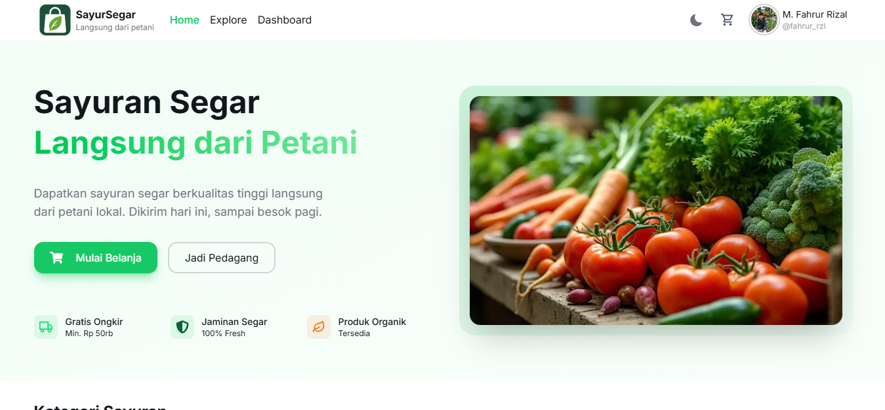

# 🥬Sayur Segar



Sebuah website jual beli sayur online yang dirancang untuk memudahkan konsumen membeli sayuran segar langsung dari petani atau supplier. Sistem ini menyediakan katalog produk, fitur transaksi online, serta manajemen data produk dan pesanan.

## 🚀 Tech Stack

- Framework: [NextJS](https://nextjs.org/) 14 (App Router)
- UI Library: [HeroUI](https://www.heroui.com/)
- Styling: [Tailwind CSS](https://tailwindcss.com/)
- Language: [TypeScript](https://www.typescriptlang.org/)
- State & Data: [TanStack Query](https://tanstack.com/query/docs)
- Linting & Formatting: ESLint + Prettier

## 📂 Project Structure

```bash
fe-sayur-segar/
│
├── app/             # Next.js App Router (pages, layouts, routes)
├── components/      # Reusable UI components
├── config/          # Konfigurasi aplikasi
├── hooks/           # Custom React hooks
├── lib/             # Utility/helper functions
├── services/        # API services
├── styles/          # Global styles
├── types/           # TypeScript types/interfaces
├── public/          # Static assets
├── .env.example     # Contoh environment variables
└── ...
```

## 🛠️ Getting Started

### 1. Clone Repository

```bash
  git clone https://github.com/fahrurrzl/fe-sayur-segar.git
  cd fe-sayur-segar
```

### 2. Install Dependencies

```bash
npm install
```

### 3. Setup Environment Variables

Buat file .env.local berdasarkan .env.example

```bash
cp .env.example .env.local
```

Lalu isi variabel sesuai kebutuhan (contoh: API base URL).

### 4. Run Development Server

```bash
npm run dev
```

## 🌐 Live Demo

[Sayur Segar](https://fe-sayur-segar.vercel.app/)
